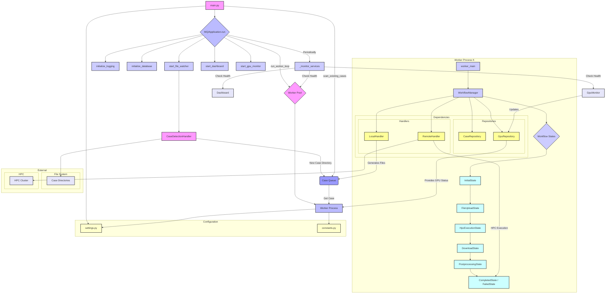

```mermaid

graph TD
    %% Main Application Flow
    A[main.py] --> B{MQIApplication.run};
    B --> C[initialize_logging];
    B --> D[initialize_database];
    B --> E[start_file_watcher];
    B --> F[start_dashboard];
    B --> G[start_gpu_monitor];
    
    %% File Watching and Queueing
    E --> H[CaseDetectionHandler];
    H -- "New Case Directory" --> I(Case Queue);
    A -- "scan_existing_cases" --> I;

    %% Worker Pool and Case Processing
    B -- "run_worker_loop" --> J{Worker Pool};
    J --> K[Worker Process];
    I -- "Get Case" --> K;

    %% Worker Process Flow (worker_main)
    subgraph Worker Process K
        L[worker_main] --> M[WorkflowManager];
        M --> N{Workflow States};
        N --> O[InitialState];
        O --> P[FileUploadState];
        P --> Q[HpcExecutionState];
        Q --> R[DownloadState];
        R --> S[PostprocessingState];
        S --> T[CompletedState / FailedState];
        
        %% Handlers and Repositories used by Workflow
        subgraph Dependencies
            subgraph Handlers
                U[LocalHandler]
                V[RemoteHandler]
            end
            subgraph Repositories
                W[CaseRepository]
                X[GpuRepository]
            end
        end
        M --> U;
        M --> V;
        M --> W;
        M --> X;
    end
    
    %% Service Monitoring
    B -- "Periodically" --> Y[_monitor_services];
    Y -- "Check Health" --> Z1[Dashboard];
    Y -- "Check Health" --> Z2[GpuMonitor];
    Y -- "Check Health" --> J;

    %% Data Flow
    Z2 -- "Updates" --> X[GpuRepository];
    X -- "Provides GPU Status" --> K;
    U -- "Generates Files" --> I;
    V -- "HPC Execution" --> T;
    
    %% External Components
    subgraph External
        subgraph File System
            FA[Case Directories]
        end
        subgraph HPC
            FB[HPC Cluster]
        end
    end
    H --> FA;
    V --> FB;

    %% Configuration
    subgraph Configuration
        CA[settings.py]
        CB[constants.py]
    end
    A --> CA;
    K --> CA;
    K --> CB;

    style A fill:#f9f,stroke:#333,stroke-width:2px
    style B fill:#bbf,stroke:#333,stroke-width:2px
    style C fill:#ccf,stroke:#333,stroke-width:2px
    style D fill:#ccf,stroke:#333,stroke-width:2px
    style E fill:#ccf,stroke:#333,stroke-width:2px
    style F fill:#ccf,stroke:#333,stroke-width:2px
    style G fill:#ccf,stroke:#333,stroke-width:2px
    style H fill:#f9f,stroke:#333,stroke-width:2px
    style I fill:#99f,stroke:#333,stroke-width:2px
    style J fill:#f9f,stroke:#333,stroke-width:2px
    style K fill:#bbf,stroke:#333,stroke-width:2px
    style L fill:#ccf,stroke:#333,stroke-width:2px
    style M fill:#ccf,stroke:#333,stroke-width:2px
    style N fill:#ccf,stroke:#333,stroke-width:2px
    style O fill:#cff,stroke:#333,stroke-width:2px
    style P fill:#cff,stroke:#333,stroke-width:2px
    style Q fill:#cff,stroke:#333,stroke-width:2px
    style R fill:#cff,stroke:#333,stroke-width:2px
    style S fill:#cff,stroke:#333,stroke-width:2px
    style T fill:#cff,stroke:#333,stroke-width:2px
    style U fill:#ff9,stroke:#333,stroke-width:2px
    style V fill:#ff9,stroke:#333,stroke-width:2px
    style W fill:#ff9,stroke:#333,stroke-width:2px
    style X fill:#ff9,stroke:#333,stroke-width:2px
    style Y fill:#ccf,stroke:#333,stroke-width:2px
    style Z1 fill:#e6e6fa,stroke:#333,stroke-width:2px
    style Z2 fill:#e6e6fa,stroke:#333,stroke-width:2px
    style FA fill:#e6e6fa,stroke:#333,stroke-width:2px
    style FB fill:#e6e6fa,stroke:#333,stroke-width:2px
    style CA fill:#ffc,stroke:#333,stroke-width:2px
    style CB fill:#ffc,stroke:#333,stroke-width:2px
```